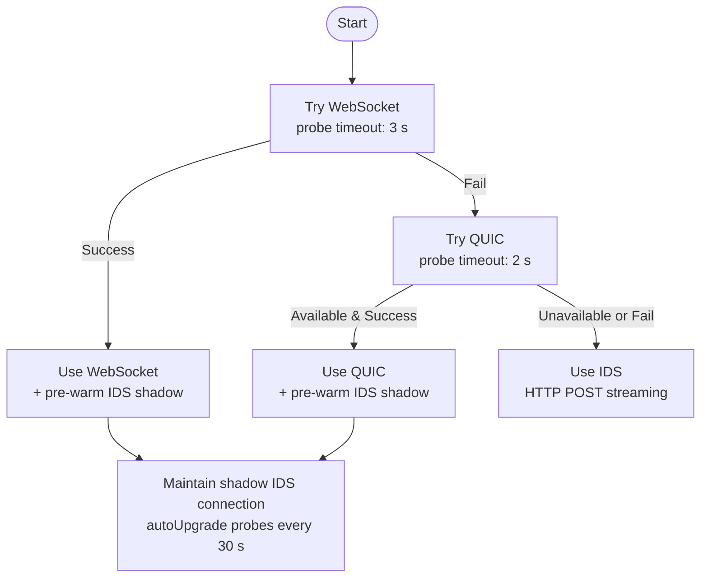
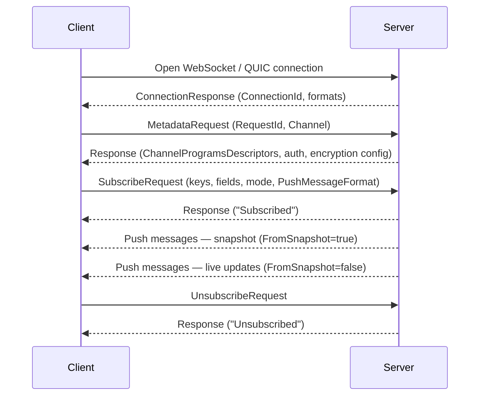
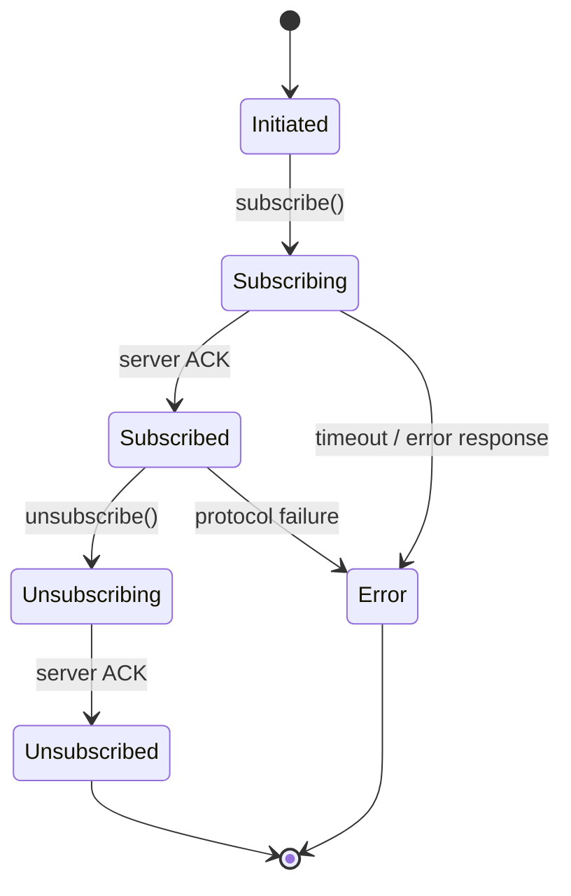
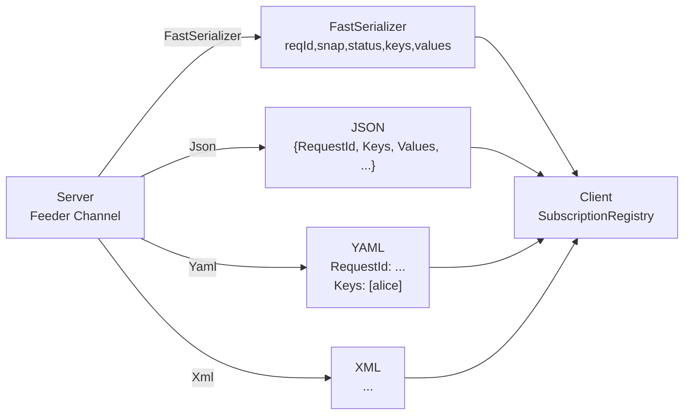
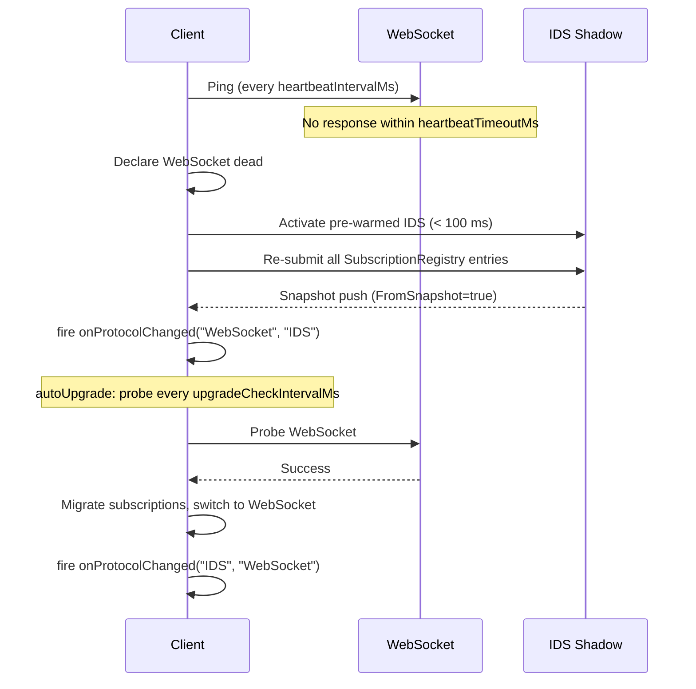
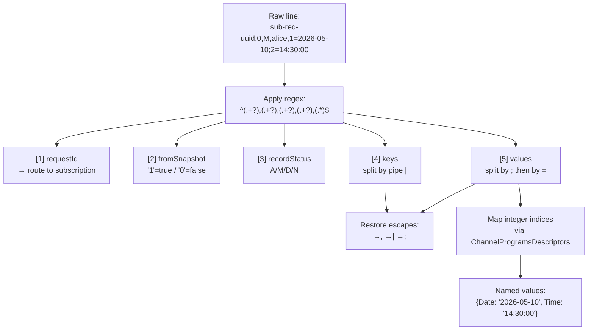

# ThunderPropagator Clients — Documentation

> Generated documentation for the **ThunderPropagator Client Protocol Specification** repository.
> Protocol specification: [`README_Clients_Protocol.md`](../README_Clients_Protocol.md)

## Contents

- [Overview](#overview)
- [Transport Layer](#transport-layer)
- [Connection & Handshake](#connection--handshake)
- [Authentication](#authentication)
- [Format Negotiation](#format-negotiation)
- [Subscriptions & Push Formats](#subscriptions--push-formats)
- [Record Status Codes](#record-status-codes)
- [Splitter Escaping](#splitter-escaping)
- [Heartbeat](#heartbeat)
- [Reconnection & Failover](#reconnection--failover)
- [Configuration Reference](#configuration-reference)
- [Mobile Lifecycle](#mobile-lifecycle)
- [Encryption Support](#encryption-support)
- [Error Handling](#error-handling)
- [Client Library Status](#client-library-status)
- [Diagrams](#diagrams)
- [Coverage Audit](#coverage-audit)

---

## Overview

ThunderPropagator is a real-time data streaming platform. This repository is the **authoritative protocol specification** for all client libraries — regardless of language or platform. Every client must implement exactly this protocol; deviations require an approved RFC against this repository.

Key design goals:

- **Universal connectivity** — IDS (HTTP/1.1 streaming) is an always-available fallback that works through all corporate proxies, firewalls, and NATs.
- **High throughput** — `FastSerializer` compact text format minimises wire overhead for real-time streaming.
- **Multiple wire formats** — JSON, YAML, and XML push formats for interoperability and human readability.
- **Resilient connections** — Pre-warmed shadow IDS connection, automatic failover within 100 ms, seamless re-subscription.

Full specification: [`README_Clients_Protocol.md`](../README_Clients_Protocol.md)

[↑ Back to top](#contents)

---

## Transport Layer

Three transport protocols are tried in priority order:

| Priority | Protocol | Transport | Notes |
|----------|----------|-----------|-------|
| 1 | WebSocket | TCP (`ws://` / `wss://`) | Preferred; works in most environments |
| 2 | QUIC | UDP (HTTP/3) | Modern environments only |
| 3 | IDS (InfiniteDataStream) | HTTP/1.1 | **Always available — universal fallback** |

IDS cannot be disabled. When WebSocket or QUIC is active, a pre-warmed shadow IDS connection is maintained so failover takes < 100 ms.

IDS uses two separate HTTP operations per subscription:
- **Downstream**: `POST /thunderPropagator/{channelName}/subscribe` — long-running streaming response.
- **Metadata** (IDS only): `GET /channel/{channelName}/metadata`.

See [§2 Supported Protocols](../README_Clients_Protocol.md#2-supported-protocols) and [§3 Protocol Negotiation & IDS Fallback](../README_Clients_Protocol.md#3-protocol-negotiation--ids-fallback).

[↑ Back to top](#contents)

---

## Connection & Handshake

### WebSocket / QUIC

1. Client opens a connection.
2. **Server sends the first message** — a JSON `ConnectionResponse`:

```json
{
  "ConnectionId": "550e8400-e29b-41d4-a716-446655440000",
  "IsAvailable": true,
  "RequestResponseConfiguration": {
    "MessageFormat": "Json",
    "SupportedMessageFormats": ["Json", "Yaml", "Xml"]
  },
  "PushMessageConfiguration": {
    "MaxPushSize": 65536,
    "MessageFormat": "FastSerializer",
    "SupportedMessageFormats": ["FastSerializer", "Json", "Yaml", "Xml"]
  }
}
```

3. Client stores `ConnectionId` and includes it in all subsequent requests.
4. Messages starting with `PROBE` must be silently ignored.
5. `IsAvailable: false` — disconnect and retry.

### IDS

No persistent connection. `ConnectionId` is a client-generated UUID v4. Each subscription is a separate long-running HTTP POST.

See [§4 Connection Handshake](../README_Clients_Protocol.md#4-connection-handshake).

[↑ Back to top](#contents)

---

## Authentication

Credentials are sent **per-request in the request body** — never in HTTP headers.

| Mode | Description |
|------|-------------|
| None | Omit `Token`, `Username`, `Password` |
| Bearer Token | Set `Token` to the OAuth2 JWT; null the others |
| Basic (RSA-encrypted) | Encrypt `Username` and `Password` with the server's RSA public key from channel metadata |

For Basic auth, clients must first request channel metadata to obtain the RSA public key and key size.

See [§5 Authentication](../README_Clients_Protocol.md#5-authentication).

[↑ Back to top](#contents)

---

## Format Negotiation

Two independent format negotiations happen per connection:

### Request/Response (control-plane)

| Format | Required | Notes |
|--------|----------|-------|
| `Json` | Yes | Default; always supported |
| `Yaml` | Optional | Server may support |
| `Xml` | Optional | Server may support |
| `FastSerializer` | **Never** | Invalid for requests/responses |

Effective format reported in `RequestResponseConfiguration.MessageFormat`.

### Push messages (subscription data)

| Format | Required | Notes |
|--------|----------|-------|
| `FastSerializer` | **Yes — mandatory** | Compact binary-text format |
| `Json` | Recommended | Interoperability |
| `Yaml` | Optional | Human-readable consumers |
| `Xml` | Optional | Enterprise/schema-driven |

Effective format reported in `PushMessageConfiguration.MessageFormat`. Clients request a preferred format in the `Subscribe` request via `PushMessageFormat`.

See [§5.4 Push message format negotiation](../README_Clients_Protocol.md#54-push-message-format-negotiation) and [§5.5 Request/response format negotiation](../README_Clients_Protocol.md#55-requestresponse-message-format-negotiation).

[↑ Back to top](#contents)

---

## Subscriptions & Push Formats

### Subscribe request fields

| Field | Type | Description |
|-------|------|-------------|
| `SubscribingKeys` | object[] | Key-value dictionaries; each entry subscribes to one key combination |
| `SubscribingFields` | string[] | Field names to receive; empty = all fields |
| `SubscriptionMode` | enum | `"Full"` (all values on every update) or `"Changes"` (only changed fields) |
| `PushMessageFormat` | string | Optional preferred push format (`"FastSerializer"`, `"Json"`, `"Yaml"`, `"Xml"`) |

On successful subscription, the server immediately sends a **snapshot** — all existing data matching the keys. Snapshot messages have `FromSnapshot: true`.

### FastSerializer format

```
{requestId},{fromSnapshot},{recordStatus},{key1|key2|...},{index=value;index=value;...}
```

Parsing regex: `^(.+?),(.+?),(.+?),(.+?),(.*)$`

| Group | Field | Notes |
|-------|-------|-------|
| 1 | `requestId` | Routes to the correct subscription |
| 2 | `fromSnapshot` | `"1"` = snapshot, `"0"` = live |
| 3 | `recordStatus` | A / M / D / N (see [Record Status Codes](#record-status-codes)) |
| 4 | `keys` | Pipe-separated subscription key values |
| 5 | `values` | Semicolon-separated `index=value` pairs; map via `ChannelProgramsDescriptors` |

### JSON push message

```json
{
  "RequestId": "sub-req-uuid-1234",
  "FromSnapshot": false,
  "RecordStatus": "M",
  "Keys": ["alice"],
  "Values": { "Date": "2026-05-10", "Time": "14:30:00.123" }
}
```

### YAML push message

```yaml
RequestId: sub-req-uuid-1234
FromSnapshot: false
RecordStatus: M
Keys:
  - alice
Values:
  Date: 2026-05-10
  Time: "14:30:00.123"
```

### XML push message

```xml
<PushMessage>
  <RequestId>sub-req-uuid-1234</RequestId>
  <FromSnapshot>false</FromSnapshot>
  <RecordStatus>M</RecordStatus>
  <Keys><Key>alice</Key></Keys>
  <Values>
    <Date>2026-05-10</Date>
    <Time>14:30:00.123</Time>
  </Values>
</PushMessage>
```

See [§9 Subscription Model](../README_Clients_Protocol.md#9-subscription-model) and [§10 Push Message Formats](../README_Clients_Protocol.md#10-subscription-push-message-formats).

[↑ Back to top](#contents)

---

## Record Status Codes

| Code | Constant | Meaning |
|------|----------|---------|
| `A` | Added | Record newly created |
| `M` | Modified | One or more field values changed |
| `D` | Deleted | Record removed (values array will be empty) |
| `N` | Neutral | No change — included for informational purposes |

See [§11 Record Status Codes](../README_Clients_Protocol.md#11-record-status-codes).

[↑ Back to top](#contents)

---

## Splitter Escaping

Applies to `FastSerializer` only. The server replaces delimiter characters in field values before transmission; clients must restore them after parsing.

| Escape Sequence | Original Character |
|-----------------|--------------------|
| `<C>` | `,` (comma) |
| `<PI>` | `\|` (pipe) |
| `<SC>` | `;` (semicolon) |

Apply restoration to all string values in regex groups [1], [4], and [5].

See [§12 Splitter Escaping](../README_Clients_Protocol.md#12-splitter-escaping).

[↑ Back to top](#contents)

---

## Heartbeat

| Setting | Default | Description |
|---------|---------|-------------|
| `heartbeatIntervalMs` | 15 000 ms | How often to send `Ping` request |
| `heartbeatTimeoutMs` | 5 000 ms | Timeout before declaring protocol dead |

On IDS: `GET /thunderPropagator/ping` every `heartbeatIntervalMs`. Non-200 triggers IDS reconnection.

See [§13 Heartbeat](../README_Clients_Protocol.md#13-heartbeat).

[↑ Back to top](#contents)

---

## Reconnection & Failover

On transport failure:

1. **Detect** — heartbeat timeout or TCP/WebSocket close event.
2. **Failover** — activate pre-warmed IDS within **100 ms**.
3. **Re-subscribe** — re-submit every entry in `SubscriptionRegistry`.
4. **Snapshot** — server resends full snapshot; `FromSnapshot: true`; callbacks fire normally.
5. **Resume** — `onProtocolChanged(from, to)` fires; application code is unaware of the transport switch.

**Exponential backoff**: base 1 s, max 60 s, formula `min(base × 2^attempt, max)`.

**Auto-upgrade**: when `autoUpgrade: true`, client probes preferred protocol every `upgradeCheckIntervalMs` (default: 30 s). On success, migrates subscriptions and upgrades silently.

See [§14 Reconnection & State Recovery](../README_Clients_Protocol.md#14-reconnection--state-recovery).

[↑ Back to top](#contents)

---

## Configuration Reference

| Option | Type | Default | Description |
|--------|------|---------|-------------|
| `url` | string | required | Server URL |
| `protocols` | string[] | `["WebSocket","QUIC","IDS"]` | Protocol preference order |
| `idsAsLastResort` | bool | `true` | IDS always available — cannot be disabled |
| `autoUpgrade` | bool | `true` | Probe and upgrade to preferred protocol |
| `upgradeCheckIntervalMs` | int | 30 000 | Upgrade probe interval |
| `heartbeatIntervalMs` | int | 15 000 | Ping interval |
| `heartbeatTimeoutMs` | int | 5 000 | Timeout before declaring protocol dead |
| `probeTimeoutMs` | int | 3 000 | Protocol probe timeout during negotiation |
| `reconnectBaseDelayMs` | int | 1 000 | Backoff base delay |
| `reconnectMaxDelayMs` | int | 60 000 | Backoff maximum delay |
| `messageFormat` | string | `"Json"` | Preferred request/response format |
| `pushMessageFormat` | string | `"FastSerializer"` | Preferred push format |
| `auth` | object | `null` | `{ type: "Bearer", token }` or `{ type: "Basic", username, password }` |
| `backgroundBehaviour` | enum | `SwitchToIDS` | Mobile: `SwitchToIDS`, `Disconnect`, or `KeepAlive` |
| `backgroundHeartbeatIntervalMs` | int | 60 000 | Heartbeat interval while backgrounded |

See [§15 Configuration Reference](../README_Clients_Protocol.md#15-configuration-reference).

[↑ Back to top](#contents)

---

## Mobile Lifecycle

| Event | Required Action |
|-------|----------------|
| App backgrounds | Stop WS/QUIC heartbeats; switch to IDS; increase heartbeat interval; register background OS task |
| App foregrounds | Probe preferred protocol; upgrade from IDS; resume normal heartbeat interval |
| Network transition (WiFi → Cellular) | Re-negotiate from scratch |

Platform notes:
- **watchOS**: IDS only after 30 s in background; short subscription lifetimes.
- **tvOS**: No background restrictions — behaves like macOS.
- **Widgets / App Clips**: IDS only; no long-lived connections.

See [§16 Mobile & Background Lifecycle](../README_Clients_Protocol.md#16-mobile--background-lifecycle).

[↑ Back to top](#contents)

---

## Encryption Support

If `MessageEncryption.IsEnabled: true` in channel metadata:

1. Read encryption key and key size from `MessageEncryption` in metadata.
2. Decrypt all received push messages with RSA before parsing.
3. RSA-encrypt all authentication credentials before transmission.

Clients that do not implement encryption must reject such channels and throw a `FeatureNotSupportedException`.

See [§17 Encryption Support](../README_Clients_Protocol.md#17-encryption-support).

[↑ Back to top](#contents)

---

## Error Handling

### Response codes

| Code | Meaning | Client action |
|------|---------|---------------|
| 200 | OK | Process response |
| 400 | Bad request | Log; do not retry same request |
| 401 | Unauthorized | Re-authenticate; retry once |
| 403 | Forbidden | Log; do not retry |
| 404 | Channel not found | Throw `ChannelNotFoundException` |
| 422 | Validation error | Extract message from `ResponseContent`; throw |
| 500 | Server error | Exponential backoff retry |
| 503 | Unavailable | Exponential backoff retry |

### Invalid push payload

1. Log raw message at `Warning` level.
2. Skip the message — do not crash the subscription.
3. Increment metric `thunderpropagator.receive.parse_errors_total`.

See [§18 Error Handling](../README_Clients_Protocol.md#18-error-handling).

[↑ Back to top](#contents)

---

## Client Library Status

| Language | Package | Repository | Status |
|----------|---------|------------|--------|
| .NET (C#) | `ThunderPropagator.Clients.DotNet` | [Clients.DotNet](https://github.com/KiarashMinoo/ThunderPropagator.Clients.DotNet) | ✅ Reference implementation |
| JavaScript / TypeScript | `@thunderpropagator/client` | Clients.JS | 🔲 Planned |
| Python | `thunderpropagator-client` | Clients.Python | 🔲 Planned |
| Java | `com.thunderpropagator:client` | Clients.Java | 🔲 Planned |
| Go | `github.com/KiarashMinoo/thunderpropagator-go` | Clients.Go | 🔲 Planned |
| Rust | `thunderpropagator-client` | Clients.Rust | 🔲 Planned |
| C++ | `thunderpropagator-cpp` | Clients.Cpp | 🔲 Planned |
| Swift / Objective-C | SPM package | Clients.Swift | 🔲 Planned |
| Flutter / Dart | `thunderpropagator_client` | Clients.Flutter | 🔲 Planned |

See [§20 Client Library Implementations](../README_Clients_Protocol.md#20-client-library-implementations).

[↑ Back to top](#contents)

---

## Diagrams

### Protocol Negotiation



*Negotiation always terminates at IDS. A shadow IDS connection is pre-warmed while using WebSocket or QUIC so failover takes < 100 ms.*

[↑ Back to top](#contents)

### Connection Handshake & Subscription Lifecycle



*For IDS, each subscription is a separate long-running HTTP POST with no server handshake message.*

[↑ Back to top](#contents)

### Subscription State Machine



*On protocol switch, all `Subscribed` entries are re-submitted as fresh `Subscribe` requests over the new transport.*

[↑ Back to top](#contents)

### Push Message Formats



*All formats carry equivalent data. `FastSerializer` is required; others are optional per platform.*

[↑ Back to top](#contents)

### IDS Failover & Auto-Upgrade



[↑ Back to top](#contents)

### FastSerializer Parsing Flow



[↑ Back to top](#contents)

---

## Coverage Audit

| Folder | Required Sections | Status | Notes |
|--------|-------------------|--------|-------|
| Root (`/`) | Overview, Files, Diagrams | ✅ | Full spec present in `README_Clients_Protocol.md` |
| `/docs` | Landing, Diagrams, Catalog | ✅ | This file; all sections present |

*This is a specification-only repository with no source code folders. Documentation is derived entirely from [`README_Clients_Protocol.md`](../README_Clients_Protocol.md). No heuristic inference was required.*

**Last generated:** 2026-05-13
