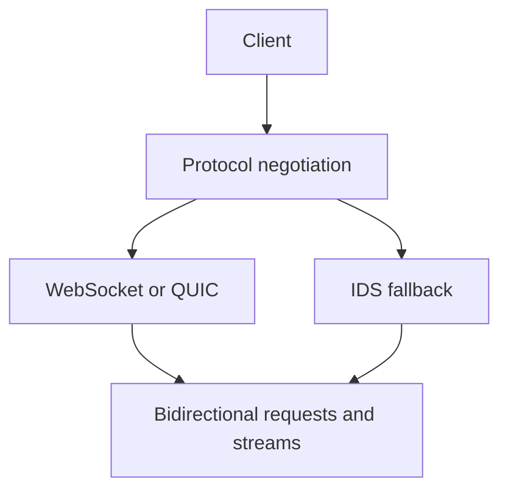

# ThunderPropagator.Clients Documentation

Authoritative ThunderPropagator client protocol specification covering wire formats, transports, authentication, subscriptions, failover, and compliance.

## Contents

- [Overview](#overview)
- [Documentation areas](#documentation-areas)
- [Repository files](#repository-files)
- [Protocol specification](#protocol-specification)
- [Diagrams](#diagrams)
- [Package dependencies](#package-dependencies)
- [Coverage audit](#coverage-audit)

## Overview

Authoritative ThunderPropagator client protocol specification covering wire formats, transports, authentication, subscriptions, failover, and compliance.

## Documentation areas

This repository is documentation- or policy-focused. Its authoritative specifications and shared configuration are cataloged below rather than represented as source-code areas.

## Repository files

| File | Purpose |
|---|---|
| [`README_Clients_Protocol.md`](../README_Clients_Protocol.md) | Contains the readme clients protocol implementation or configuration. |

## Protocol specification

The [ThunderPropagator Client Protocol Specification](../README_Clients_Protocol.md) is the normative guide for compatible client implementations. It covers:

- [1. Overview](../README_Clients_Protocol.md#1-overview)
- [2. Supported Protocols](../README_Clients_Protocol.md#2-supported-protocols)
- [3. Protocol Negotiation & IDS Fallback](../README_Clients_Protocol.md#3-protocol-negotiation--ids-fallback)
- [4. Connection Handshake](../README_Clients_Protocol.md#4-connection-handshake)
- [5. Authentication](../README_Clients_Protocol.md#5-authentication)
- [6. Channel Metadata](../README_Clients_Protocol.md#6-channel-metadata)
- [7. Request Format](../README_Clients_Protocol.md#7-request-format)
- [8. Response Format](../README_Clients_Protocol.md#8-response-format)
- [9. Subscription Model](../README_Clients_Protocol.md#9-subscription-model)
- [10. Subscription Push Message Formats](../README_Clients_Protocol.md#10-subscription-push-message-formats)
- [11. Record Status Codes](../README_Clients_Protocol.md#11-record-status-codes)
- [12. Splitter Escaping](../README_Clients_Protocol.md#12-splitter-escaping)
- [13. Heartbeat](../README_Clients_Protocol.md#13-heartbeat)
- [14. Reconnection & State Recovery](../README_Clients_Protocol.md#14-reconnection--state-recovery)
- [15. Configuration Reference](../README_Clients_Protocol.md#15-configuration-reference)
- [16. Mobile & Background Lifecycle](../README_Clients_Protocol.md#16-mobile--background-lifecycle)

## Diagrams

```mermaid
flowchart TD
  Client["Client"] --> Negotiate["Protocol negotiation"]
  Negotiate --> Fast["WebSocket or QUIC"]
  Negotiate --> IDS["IDS fallback"]
  Fast --> Stream["Bidirectional requests and streams"]
  IDS --> Stream
```

Clients negotiate the fastest compatible transport, fall back safely when required, and preserve request, response, and subscription semantics across transports.

## Package dependencies

*No external package dependencies were detected from supported manifests.*

## Coverage audit

| Documentation area | Status | Files | Types | Retry passes |
|---|---|---:|---:|---:|
| Repository specification and policy | ✅ Complete | — | — | 1 |

**Last generated:** July 27, 2026
